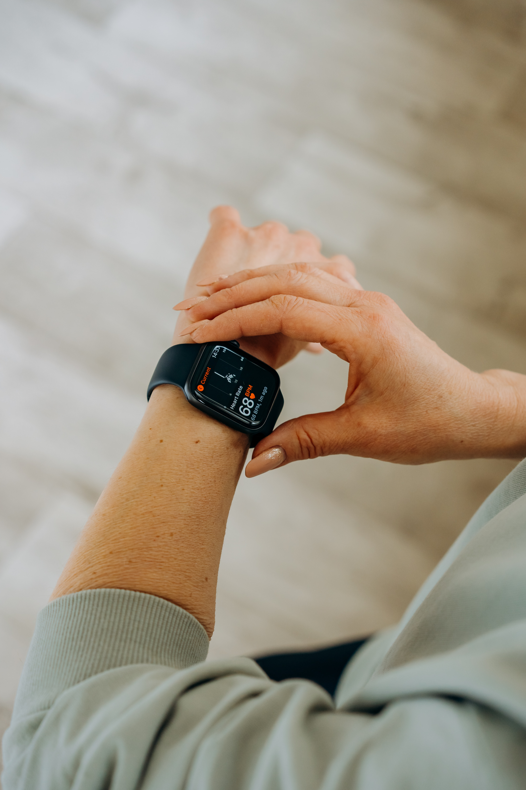

# . Introduction

Bellabeat is a high-tech company founded in 2013, that manufactures health-focused smart products. Bellabeat aims at empowering women with knowledge about their own health habits by collecting data on activity, sleep, stress, and reproductive health. It has grown rapidly and quickly positioned itself as a tech-driven wellness company for women.

Bellabeat's products:

* **Bellabeat app**: The Bellabeat app provides users with health data related to their activity, sleep, stress, menstrual cycle, and mindfulness habits. This data can help users better understand their current habits and make healthy decisions. The Bellabeat app connects to their line of smart wellness products.
* **Leaf**: Bellabeat’s classic wellness tracker can be worn as a bracelet, necklace, or clip. The Leaf tracker connects to the Bellabeat app to track activity, sleep, and stress.
* **Time**: This wellness watch combines the timeless look of a classic timepiece with smart technology to track user activity, sleep, and stress. The Time watch connects to the Bellabeat app provide you with insights into your daily wellness.
* **Spring**: This is a water bottle that tracks daily water intake using smart technology to ensure that you are appropriately hydrated throughout the day. The Spring bottle connects to the Bellabeat app to track your hydration levels.
* **Bellabeat membership**: Bellabeat also offers a subscription-based membership program for users. Membership gives users 24/7 access to fully personalized guidance on nutrition, activity, sleep, health and beauty, and mindfulness based on their lifestyle and goals.

The aim of this project is to analyze consumer smart device usage data in order to gain insight into how people are already using their smart devices and provide high-level recommendations for how these trends can inform and guide the marketing strategy for the company.

I will be focusing on identifying growth opportunities for the Bellabeat app.

This project is my capstone project for the [Google Data Analytics Professional Certificate](https://www.coursera.org/professional-certificates/google-data-analytics?).


# . Ask

## Business Task

This analysis will be analyzing smart device usage data to gain insight into how consumers use non-Bellabeat smart devices in order to identify growth opportunities for the company. I will then use these insights to provide recommendations to inform Bellabeat's marketing strategy on the following questions:

  1. **What are some trends in smart device usage?**
  2. **How could these trends help influence Bellabeat marketing strategy?**


# . Prepare

## Dataset

[FitBit Fitness Tracker](https://www.kaggle.com/datasets/arashnic/fitbit). Made available on Kaggle by [Mobius](https://www.kaggle.com/arashnic). 


There are 18 sub data sets in this directory. For the scope of this analysis, we will use the following:


* **Daily activity**
* **Sleep by day**
* **Weight log**
* **Heartrate**
  
## Data organization and format

The data is in the csv (comma-separated values) file format, and organized as long data.


## Data credibility and verification
This data-set generated by respondents to a distributed survey via Amazon Mechanical Turk between 03.12.2016-05.12.2016. Thirty eligible Fitbit users consented to the submission of personal tracker data, including minute-level output for physical activity, heart rate, and sleep monitoring.


## Data licencencing, privacy, security, and accessibility
This data is licensed under CCO: Public Domain.


## Data limitations
1. **Small sample size**: The data represents samples from 30 users for a duration of 30 days. 
2. **Lack of metadata about the sub data sets**: Data does not specify metric for heartrate.
3. **No demographic information provided**: Since Bellabeat is focused on women health, the dataset should have included information about the age, gender and health conditions of the FitBit users. The results of this analysis should not be used as the only representation of all women using fitness devices.
4. **Maybe outdated** 


# . Process
This project uses the R Programming language for all its processes because of personal preference and also because R is efficient and fast when handling a lot of data.

## Loading libraries and data
This project will use the following packages:

* tidyverse
* readr
* ggplot2
* janitor
* skimr
* here
* lubridate
* ggpubr
* ggVennDiagram
* plotly
* viridis
* hrbrthemes


```{r}
library(tidyverse) ## for general data modeling, wrangling, and visualization tasks
library(readr)
library(janitor) ## for examining and cleaning data
library(skimr) ## for summary statistics on the data frames
library(here) ## for declaring relative file paths
library(lubridate) ## for dates and times
library(ggplot2) ## for visualizations
library(ggpubr)  ## for beautiful ggplot2 visuals
library(ggVennDiagram) ## for visualization
library(plotly) # more vizs
library(viridis) # for better colors
library(hrbrthemes) # for diverse themes


```
Load data into the project
```{r}
loadData <- function(raw_data){
  read_csv(here(raw_data))
}
```
Assign data to data frames
```{r}
steps <- loadData("datas/dailyActivity_merged.csv")

```

```{r}
sleep <- loadData("datas/sleepDay_merged.csv")
```

```{r}
heart_rate <- loadData("datas/heartrate_seconds_merged.csv")
```

```{r}
weight = loadData("datas/weightLogInfo_merged.csv")
```

Preview daily_activity data
```{r}
# view the first five rows of the data frame
head(steps)

```

View all columns in daily_activity data
```{r}
colnames(steps)
```


Preview sleep_day data
```{r}
# view the first five rows of the data frame
head(sleep)
```

View all columns in sleep_day data
```{r}
colnames(sleep)
```


Preview heart_rate data
```{r}
# view the first five rows of the data frame
head(heart_rate)
```

View all columns in heart_rate data
```{r}
colnames(heart_rate)
```

Preview weight_log data
```{r}
# view the first five rows of the data frame
head(weight)
```

View all columns in weight_log data

```{r}
colnames(weight)
```


From the preview above, we can see that the four data frames have an Id field, and the data collected is from the year 2016. We also notice that all data frames have column names in camel case or start with a capital letter. For my preference and best practices, I will change them to snake lower case instead.


### Check column data types
```{r}
# check data types of each column
str(steps)
```

```{r}
# check data types of each column
str(sleep)
```

```{r}
# check data types of each column
str(heart_rate)
```

```{r}
str(weight)
```

The first sub data-sets have a date column that is of type character. I will convert it to date time in order to fit the needs of the study. The rest of the columns are of the numeric type, with an exception being in the heart rate data-set where the Time feature is a character.


### Check for missing values in the data-sets
```{r}
# add up all missing values in the data frame
sum(is.na(steps))
```

```{r}
# add up all missing values in the data frame
sum(is.na(sleep))
```

```{r}
# add up all missing values in the data frame
sum(is.na(heart_rate))
```
```{r}
sum(is.na(weight))
```

Above, we see that the weight log data frame has 65 missing values.

### Check for duplicate values
```{r}
# add up all duplicates in the data frame
sum(duplicated(steps))

```

```{r}
# add up all duplicates in the data frame
sum(duplicated(sleep))

```

```{r}
# add up all duplicates in the data frame
sum(duplicated(heart_rate))
```

```{r}
sum(duplicated(weight))
```
We observe that only the sleep data frame has duplicated values that amount to 3.


### Summary
After previewing the data, we observe that missing values and duplicated exist among the data-sets, column names need to be renamed to match best practices, the date and time columns need to be converted to a datetime type. 


## Data Cleaning
In this section, I will clean and organize the data to get it ready for analysis. I will execute the following steps:


* Drop all rows with missing values
* Drop all duplicated rows
* Rename and clean column names
* Extract time from date
* Convert the date feature to datetime in all data-sets
* Merge data-sets
* Save csv copies of the cleaned data


### Drop all rows with missing and duplicate values

```{r}
# remove rows with missing values
sleep <- sleep %>%
  drop_na() %>%
  distinct()
```

```{r}
weight <- weight %>%
  drop_na() %>%
  distinct()
```

### Rename date columns to lower snake case
```{r}
steps <- clean_names(steps)
```

```{r}
steps <- steps %>%
  rename(date = activity_date)
```

```{r}
sleep <- clean_names(sleep)
```

```{r}
heart_rate <- clean_names(heart_rate)
```

```{r}
weight <- clean_names(weight)
```


### Extract time from date
```{r}

sleep <- sleep %>%
  separate(sleep_day, into=c("date", "time"), sep=" ", extra = "merge")
```


```{r}
heart_rate <- heart_rate %>%
   separate(time, into=c("date", "time"), sep=" ", extra = "merge")
```


### Convert date to datetime data type
```{r}
# format to datetime
steps$date <- as.Date(steps$date, format="%m/%d/%Y", tz=Sys.timezone())
```

```{r}
# format to datetime
sleep$date <- as.Date(sleep$date, format="%m/%d/%Y", tz=Sys.timezone())
```

```{r}
# format to datetime
heart_rate$date <- as.Date(heart_rate$date, format="%m/%d/%Y", tz=Sys.timezone())
```

```{r}
# format to datetime
weight$date <- as.Date(weight$date, format="%m/%d/%Y", tz=Sys.timezone())
```


## Data Verification


### Verify that there are no duplicates or missing values in all datasets
```{r}
# verify that duplicates and missing values have been removed
sum(is.na(steps))
sum(duplicated(steps))
```

```{r}
# verify that duplicates and missing values have been removed
sum(is.na(sleep))
sum(duplicated(sleep))
```

```{r}
# verify that duplicates and missing values have been remove
sum(is.na(heart_rate))
sum(duplicated(heart_rate))
```

```{r}
# verify that duplicates and missing values have been remove
sum(is.na(weight))
sum(duplicated(weight))
```


### Verify data types and column name change
```{r}

class(steps$date)
class(sleep$date)
class(heart_rate$date)
class(weight$date)
```

```{r}
head(steps)
```

```{r}
head(sleep)
```

```{r}
head(heart_rate)
```
```{r}
head(weight)
```
```{r}
sample_heart_rate <- heart_rate %>%
  select(-c(time))
```
```{r}
class(weight)
```


### Export cleaned data to csv

```{r}
# export to csv
writeData <- function(df, fp) {
  write_csv(df,fp)
}

```
```{r}
writeData(steps, "datas/steps.csv")
writeData(sleep, "datas/sleep.csv")
##writeData(heart_rate, "datas/heart_rate.csv")
writeData(weight, "datas/weight.csv")
```


# . Analyze & Share
In this phase, I will analyze the data cleaned to draw insights that will inform Bellabeat's marketing strategy.


## Exploratory Data Analysis

### Research Questions

#### What are some trends in smart device usage?


##### How many unique participants are there for each dataframe?**
Load cleaned datasets
```{r}
steps_cleaned <- loadData("datas/steps.csv")
sleep_cleaned <- loadData("datas/sleep.csv")
weight_cleaned <- loadData("datas/weight.csv")
```

Preview clean data
```{r}
head(steps_cleaned)
head(sleep_cleaned)
head(weight_cleaned)
```

```{r}
# count unique participants by id
n_distinct(steps_cleaned$id)
n_distinct(sleep_cleaned$id)
n_distinct(weight_cleaned$id)

```
##### How many observations are there in each dataframe?**
```{r}
nrow(steps_cleaned)
nrow(sleep_cleaned)
nrow(sample_heart_rate)
nrow(weight_cleaned)
```

### Summary statistics  

Daily activity/steps

```{r}
steps_cleaned %>%
  select(total_steps, total_distance, very_active_minutes, sedentary_minutes) %>%
  summary()
```


Daily sleep
```{r}
sleep_cleaned %>%
  select(total_sleep_records, total_minutes_asleep, total_time_in_bed) %>%
  summary()
```

```{r}
heart_rate %>%
  select(value) %>%
  summary()
```


This summary shows that the highest record of sleep records made is 3, the average sleep time is 7 hours, and the maximum sleep time logged is 13 hours. It also indicates that the maximum time in bed asleep or not is 16 hours.

We have 33 unique participants who tracked their steps, 24 who monitored their sleep, 14 who monitored their heart rates, and 2 who monitored their weight. It seems that participants logged their heart rates exponentially, while a huge percentage of them did not log their weight. This may be because the devices they used would automatically record their heart rates as opposed to manually logging their weight and sleep time. 


```{r}
heart_rate %>%
  filter(value == 203)
```

The heart rate summary shows that there's a participant with a value of 203 bpm. According to the [Cleveland Clinic](https://my.clevelandclinic.org/health/diseases/17616-ventricular-tachycardia#:~:text=Tachycardia%20is%20a%20heart%20rate,beats%20per%20minute%20or%20more), this could be a bad sign depending on the individual's heath condition and activity (may be the user had an evening exercise since the time stamp is at 4 PM).

```{r}
heart_rate %>%
  filter(value == 36)
```
#### Heart rate discussion
On the other hand, there's a participant with the lowest heart rate of 36 bmp at 2 AM. If given metadata like age group, Bellabeat's Time watch might be able to alert the user if they were on the red zone (very high heart rate or very low heart rate).


### Unique Participants Distribution

```{r}
# create a list of unique ids from each metric 
records <- list(
  steps_by_id <- unique(steps_cleaned$id, incomparables = FALSE),
  sleep_by_id <- unique(sleep_cleaned$id, incomparables = FALSE),
  heart_rate_by_id <- unique(sample_heart_rate$id, incomparables = FALSE),
  weight_by_id <- unique(weight_cleaned$id, incomparables = FALSE)
)
```

### Feature usage of the four features

##### Figure 1
```{r}
ggVennDiagram(x=records, label_alpha = 0, category.names = c("Steps",  "Sleep", "Heart", "Weight"))

```
The above Venn diagram indicates the following feature usage among the 33 participants:

  * (100%)-33 monitored steps.
  * (67%)-22 monitored sleep, steps, and heart-rate.
  * (42%)-14 monitored steps, and heart-rate
  * (6%)-2 monitored steps, and weight.
  * (0%)-0 monitored all of the four features.
  * (21%)-7 monitored only steps.
  
The highest number of multiple feature usage is 22 participants, which includes the tracking of activity/steps, sleep, and heart-rate. This insight is the most useful to this analysis because Bellabeat's Time watch is used to monitor activity, sleep, and stress, I will focus on the usage of these three features.

### Feature usage of activity/steps, sleep, and heart-rate monitoring
##### Figure 2
```{r}
ggVennDiagram(x=records[1:3], label_alpha = 0, category.names = c("Steps",  "Sleep", "Heartrate")) + scale_fill_viridis(discrete=FALSE, alpha = 1,)
```


* 24 out of 33 participants monitored all of the three features.

with this information we can continue to explore how this usage will inform the Time watch.

### Feature usage of activity/steps, and sleep monitoring
##### Figure 3
```{r}
ggVennDiagram(x=records[c(1,2)], label_alpha = 0, category.names = c("Steps", "Sleep")) + scale_fill_viridis(discrete=FALSE, alpha = 1)
```
* 24 out of 33 participants monitored both features.

### Feature usage of activity/steps, and heart-rate monitoring
##### Figure 4
```{r}

ggVennDiagram(x=records[c(1,3)], label_alpha = 0, category.names = c("Steps", "Heartrate")) + scale_fill_viridis(discrete=FALSE)

```
* 14 out of of 33 participants monitored both of these features.


From all the diagrams above, it looks like all the participants who monitored their sleep and heart rates also tracked their activity/steps. It's also clear that some participants who tracked their activity did not monitor their sleep or heart rates.

Although there seems to be a strong relationship between these three features, let's determine if they are correlated.


Since the weight_log dataframe has only 2 observations, it is not enough to test it with the rest of the datasets. I will drop it from the analysis moving forward.
### Merging daily_activity and sleep datasets together
```{r}
combined_df <- steps_cleaned %>%
  left_join(sleep_cleaned, by=c("id", "date"))
  
```

### What's the relationship between steps taken in a day and sedentary minutes?
```{r}
g1 <- combined_df %>%
  ggplot(aes(x=total_steps, y=sedentary_minutes, color=date)) + geom_point() + geom_jitter(size=3,alpha=0.3 ) + geom_smooth()  + theme(family="Roboto") + labs(title = "Total Steps vs Sedentary Minutes", x = "Total Steps", y="Sedentary Minutes") + theme_ipsum() 
ggplotly(g1, tooltip = c("sedentary_minutes", "total_steps"))
```


* There is correlation between these two features even though it's really weak. Looking at it we can tell that as total steps increased, sedentary minutes decreased too at between 0 and 10,000 steps; but then after that the steps begin to scatter as they increase but the sedentary minutes did not decrease. 

Let's check out the correlation coefficient:  


```{r}
cor.test(combined_df$sedentary_minutes, combined_df$total_steps, method='spearman', exact=FALSE)
```


And yes, We see that there is a moderate negative correlation between the two features. There's a slight effect on sedentary time as total steps increase. However, there are some huge number of total steps taken that require further investigation before using them as model. 

Let's explore total_steps a bit more


Create level groups based off the total steps
```{r}
combined_df <- combined_df %>%
  mutate(activity_level = case_when(
    total_steps > 7000 ~ "Very High",
    total_steps > 4000 ~ "High",
    total_steps >=3000 ~ "Average",
    total_steps <=3000 ~ "Low"))
```


Distribution of Total Steps (Histogram)
```{r}
g2 <- ggplot(data=combined_df, aes(x=total_steps, color=activity_level)) + geom_histogram(alpha= 0.25) + labs(title = "Total Steps", x = "Total Steps") + theme_ipsum()
ggplotly(g2, tooltip = c("count", "total_steps", "activity_level"))

```
More summary statistics
```{r}
combined_df %>%
  count(activity_level)
```

```{r}
combined_df %>%
  count(total_steps > mean(total_steps))
```
We can see above there that the values on the total_steps graph are positively skewed, which shows that there are many values where 54% of the users recorded 7,000 and above steps while 20% recorded steps below the average steps of between 3000 and 4000 according to a Mayo Clinic article.


```{r}
g3 <- combined_df %>%
  ggplot(aes(x=date, fill=activity_level)) + geom_bar() + labs(title = "User Count in Every Level per Day", x="Date")  + theme(axis.text.x = element_text(angle = 45))
ggplotly(g3, tooltip = c("count", "activity_level"))
```

* Most users are in the very high activity level.


```{r}
g5 <- combined_df %>%
  ggplot(aes(x=total_distance, y= total_steps, color=activity_level)) + geom_point() + labs(title = "Total Steps vs Total Distance", y="Steps", x="Distance")  + theme(axis.text.x = element_text(angle = 45)) +geom_jitter(size=3,alpha=0.3 ) + geom_smooth()
ggplotly(g5, tooltip = c("total_distance", "total_steps", "activity_level"))
```


* Checking if total_steps has a positive correlation with total_distance. This will help determine some level of consistency in the data. The higher the correlation the higher the accuracy.

Calculate the correlation coefficient (Pearson's)
```{r}
combined_df %>%
  summarise(cor(total_steps, total_distance))
```


```{r}
cor.test(combined_df$total_steps, combined_df$total_distance, method="pearson")
```


* There's a strong positive linear correlation between steps taken and distance covered. This just helps us confirm that, generally as the steps increased the distance increased as well; which is the expected behavior. 


Going back to sedentary_minutes

```{r}
combined_df %>%
  summarise(mean(sedentary_minutes) / 60, max(sedentary_minutes)/60)
```
* The average hours spent not doing any activity is 16 in a day.

Let's group the records by sedentary levels
```{r}
combined_df <- combined_df %>%
  mutate(sedentary_level = case_when(
    sedentary_minutes >= 600 ~ "Very High",
    sedentary_minutes >=300 ~ "High",
    sedentary_minutes >=150 ~ "Average",
    sedentary_minutes <150 ~ "Low"))
```


Let's check out most common value in the sedentary_minutes dataframe
```{r}
findMode <- function(x) {
  ux <- unique(x)
  tab = tabulate(match(x, ux))
  ux[tab == max(tab)]
}
```
```{r}
findMode(combined_df$sedentary_minutes)
```

```{r}
combined_df %>%
  count(sedentary_minutes == 1440)
```

It turns out, there are 79 records where users were in a sedentary mode for 24 hours. 


```{r}
g3 <- ggplot(data=combined_df, aes(x=sedentary_minutes, fill=sedentary_level)) + geom_density(alpha= 0.4) + labs(title = "Sedentary Minutes", x="Sedentary Minutes") + theme_ipsum() 
ggplotly(g3, tooltip = c("sedentary_minutes", "sedentary_level"))
#grid.arrange(g1,g2, ncol=2)

```

The distribution of values in the sedentary_minutes columns is mildly skewed to the left, opposite to how total steps is.


Let's investigate more to see how sedentary minutes relate to very active minutes
```{r}
g8 <- ggplot(combined_df, aes(x=very_active_minutes, y=sedentary_minutes)) + geom_point() + labs(title = "Sedentary Minutes vs Very Active Minutes", x="Very Active Minutes", y="Sedentary Minutes")  + theme(axis.text.x = element_text(angle = 45)) + geom_jitter(size=3, alpha=0.5) + geom_smooth() + theme_ipsum()
ggplotly(g8)
```


```{r}
cor.test(combined_df$sedentary_minutes, combined_df$very_active_minutes, method="kendal")
```


According to the correlation tests, these two features have a very poor negative correlation. But their relationship still has significance. 

Just to check if all active minutes summed together equals 24 hours (one day) of activity since our data is supposedly from daily records.

```{r}
combined_df <- combined_df %>%
  mutate(daily_activity = very_active_minutes + lightly_active_minutes + 
      fairly_active_minutes + sedentary_minutes + total_time_in_bed) 
```


```{r}
combined_df <- combined_df %>%
  mutate(full_day = case_when(
    daily_activity == (60*24) ~ "Day",
    daily_activity > (60*24) ~ "More",
    daily_activity < (60*24) ~ "Less"
    
  ))
```
```{r}
combined_df %>%
  count(full_day)
```
Here we see NA because most users did not track their time in bed, but on the other hand almost half of the user activity is less than or more than the 24 hours even before adding time in bed.

Let's see how it would look like without the NA values
```{r}
test_copy <- combined_df
sum(is.na(test_copy))
```
```{r}
test_copy <- test_copy %>%
  drop_na()
```


```{r}
sum(is.na(test_copy))
```
```{r}
test_copy %>%
  count(full_day)
```
```{r}
ggplot(test_copy, aes(x=full_day, fill=full_day)) + geom_bar(alpha= 0.3) + theme_ipsum() + labs(title = "Do values exceed or are less than 24 hours?", x="Day or Not")  + theme(axis.text.x = element_text(angle = 45, family = "Roboto"))
```


Here we can tell that more than 150 entries of activities are of more than 24 hours.

```{r}
g4 <- combined_df %>%
  ggplot(aes(x=date, fill=sedentary_level)) + geom_bar() + labs(title = "User Count in Every Sedentary Level per Day", x="Date")  + theme(axis.text.x = element_text(angle = 45))
ggplotly(g4, tooltip = c("count", "sedentary_level"))
```


* The moderate negative relationship between total_steps and sedentary minutes suggests that there's potential for users to take more steps, and to increase their activity levels. Better tracking devices and awareness could help boost users to the right direction.


### What's the relationship between minutes asleep and time in bed?
```{r}
cor_sleep_bed <- combined_df %>%
  ggplot(aes(x=total_minutes_asleep, y=total_sleep_records, group=date)) + geom_point() + geom_jitter(size=5,alpha=1 ) + geom_smooth()  +theme(axis.text.x = element_text(angle = 45))  + labs(title = " Total Records vs Minutes Asleep", x = "Minutes Asleep", y="Total Records") + theme_ipsum() 
ggplotly(cor_sleep_bed)
```
```{r}
cor.test(combined_df$total_sleep_records, combined_df$total_minutes_asleep, method='spearman', exact=FALSE)

```
```{r}
cor.test(combined_df$total_sleep_records, combined_df$total_minutes_asleep, method="pearson")
```

 
There's a very small positive correlation between time asleep and total records.There maybe an issue with the logging of the records, something that Bellabeat's Time watch could utilize to their benefit.

```{r}
sleep %>%
  filter(total_time_in_bed == 961)
```
It looks like there are 2 users who logged the highest amount of time in bed; 16 hours in total and at least 10 hours of sleep on four different days! This may or may not be an error in logging since all the time stamps in the entire dataset are recorded at 12 AM. This is a case where the Time watch could introduce automatic logging to avoid logging errors.


```{r}
d1 <- ggplot(data=combined_df, aes(x=total_minutes_asleep, y=total_time_in_bed, group=date))+ geom_point() + geom_smooth(alpha=0.3) + theme(axis.text.x = element_text(angle = 45))  + labs(title = "Time in Bed vs Time Asleep", x="Minutes Asleep", y="Minutes in Bed") + theme_ipsum()
```


```{r}
ggplotly(d1)
```
```{r}
cor.test(combined_df$total_minutes_asleep, combined_df$total_time_in_bed, method='spearman', exact=FALSE)
```
It's clear that as time in asleep increased so did time in bed, which is what you would expect. 


### Does Walking More Burn More Calories?
```{r}
calorie_steps_cor <- combined_df %>%
  ggplot(aes(x=total_steps, y=calories, hue=date, color=time)) +  geom_jitter(size=5,alpha=1 ) + geom_smooth()  +theme(axis.text.x = element_text(angle = 45))  + labs(title = "Calorie Burn vs Total Steps Walked", x = "Total Steps", y="Calories") + theme_ipsum()
ggplotly(calorie_steps_cor)
```


Here, we see that most participants logged in between 9000 and 15000 steps. And we can see that though it's not completely linear, there's a moderate positive correlation between steps and calorie burn. 

```{r}
cor.test(combined_df$total_steps, combined_df$calories, method='spearman', exact=FALSE)
```
```{r}
heart_rate <- heart_rate %>%
  mutate(heart_rate_level = case_when(
    value <= 60 ~ "Low",
    value > 60 & value <= 170 ~ "Average",
    value >170 ~ "High"))
```
```{r}
heart_rate %>%
  count(heart_rate_level)
```

```{r}
level_group <- heart_rate %>%
  select(heart_rate_level, date)
```
```{r}
g8 <- level_group %>%
  ggplot(aes(x=heart_rate_level, fill=heart_rate_level)) + geom_bar()  +theme(axis.text.x = element_text())  + labs(title = "Heart Rate By Levels", x= "Level") + theme_ipsum()
ggplotly(g8, tooltip = c("count"))
```


```{r}
heart_rate %>%
  summarise(mean(value), max(value), median(value))
```


```{r}
ggplot(combined_df, aes(y=total_minutes_asleep, x=total_steps, color=date, fill=activity_level)) + geom_point() + geom_jitter(size=3,alpha=1 ) + geom_smooth()  +theme(axis.text.x = element_text(angle = 45))  + labs(title = "Total Minutes Asleep vs Total Steps", y="Total Minutes Asleep", x= "Total Steps") + theme_ipsum() 
```
```{r}
cor.test(combined_df$total_minutes_asleep, combined_df$total_steps, method="spearman", exact = F)
```


# . Act Phase

2. **How could these trends help influence Bellabeat marketing strategy?** 

These trends apply to Bellabeat's customers because they also track  their sleep, stress, and activity. Therefore the insights drawn from this exploration apply to them.

## Recommendations

Based on the trends discovered in the Fitbit datasets for 33 users from April to May, 2016, I can make the following recommendations to Bellabeat's marketing team, especially in regards the Time watch.

* Record user demographics. This will help customize the Time watch device to meet the needs of different demographics by providing useful tips about sleep, activity, and stress. Bellabeat's Time watch should be able to alert the user if they were on the red zone (very high heart rate or very low heart rate).[heart rate discussion]

* Create a social media advert that highlights that the Time watch device could improve user tracking of sleep, heart rate, and activity because it automatically detects and logs the data instead of the user manually logging activity. (This is in response to the issue that was reflected in the [summary statistics])

* Provide multi-feature synchronicity and convenience to avoid the issue of missing records as observed throughout [figure 1], [figure 2], [figure 3], [figure 4]


* Encourage users and potential users to monitor their activity, sleep, and stress levels by:
  1. Sharing with users personalized information highlighting their milestones.
  2. Sending push notifications reminding users to meet their goals (within the scope of Bellabeat's services)  .
  3. Politely send useful statistics about the user's progress as far as their T&C.

  
**Bonus Recommendation**

* In addition to monitoring sleep, activity, and stress levels through heart rate; Bellabeat could look into providing a digital scale that syncs with all the other devices and saves use weight automatically together with the rest. This will counter the probable failure to log weight among the Fitbit users, something that could be attributed to having to manually type in the numbers every time a user stands on the scale. (There maybe cutting-edge technologies that can detect someone's weight using a wrist-band).


# . References


* [WHO](https://www.who.int/news-room/fact-sheets/detail/physical-activity)
* [Mayo Clinic](https://www.mayoclinic.org/healthy-lifestyle/fitness/in-depth/10000-steps/art-20317391#:~:text=The%20average%20American%20walks%203%2C000,a%20day%20every%20two%20weeks)

* [kaggle user](https://www.kaggle.com/code/mimosabella/fitness-tracker-a-usage-trends-analysis-with-r/notebook)
* [kaggle user](https://www.kaggle.com/code/zulkhaireesulaiman/bellabeat-capstone-project-in-r)
* [R Gallery](https://r-graph-gallery.com/index.html)
* [Healthline](https://www.healthline.com/health/dangerous-heart-rate#dangerous-heart-rate)
* [RStudio Community](https://community.rstudio.com/)
* [Stackoverflow](https://stackoverflow.com/questions/)
* [Datascience made simple](https://www.datasciencemadesimple.com/join-in-r-merge-in-r/)
* [Statistics globe](https://statisticsglobe.com/get-last-value-of-vector-in-r)
* [Datanovia](https://www.datanovia.com/en/blog/venn-diagram-with-r-or-rstudio-a-million-ways/)
* [Statology](https://www.statology.org/mode-in-r/)


Thank you for reading!


